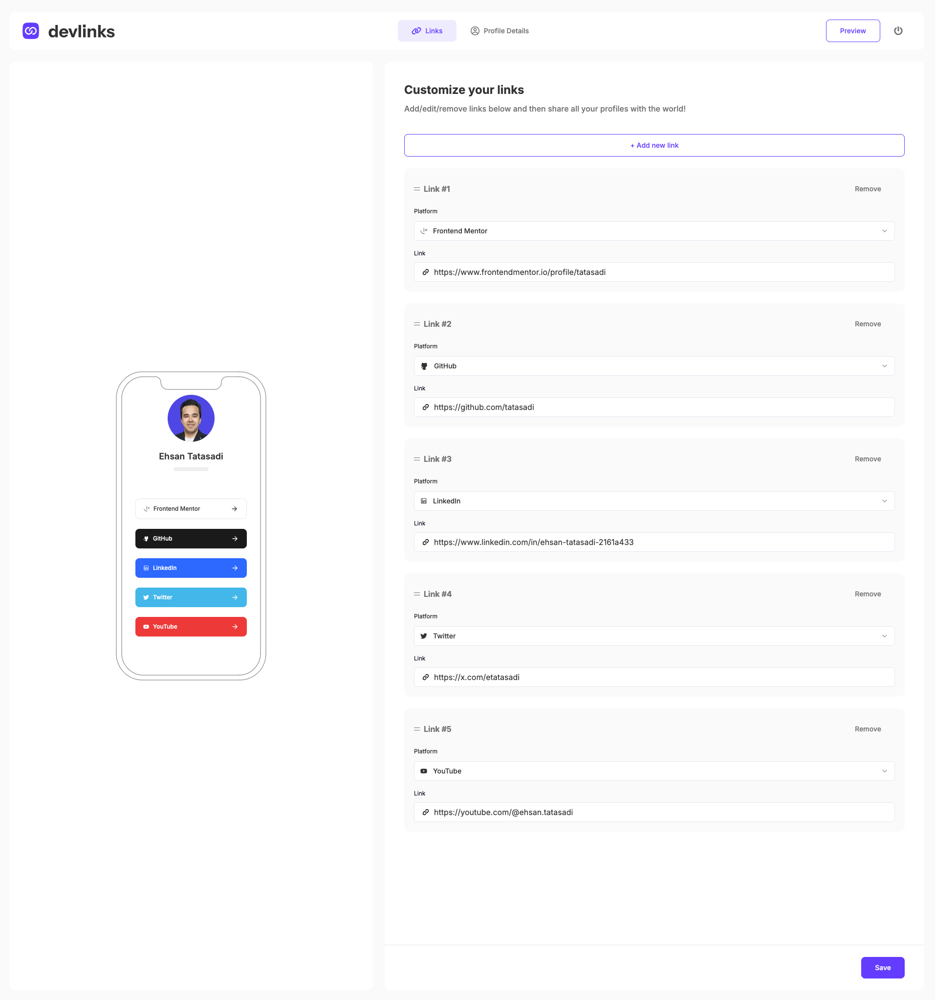
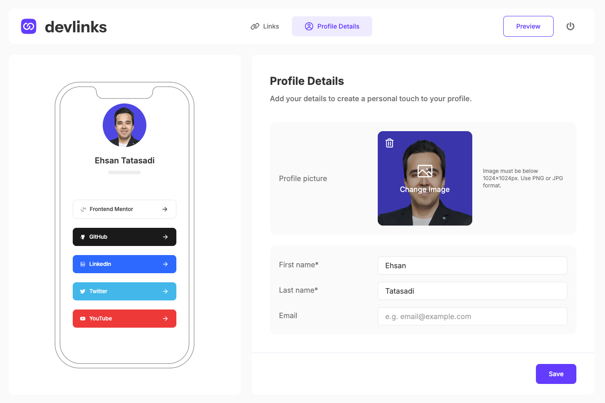
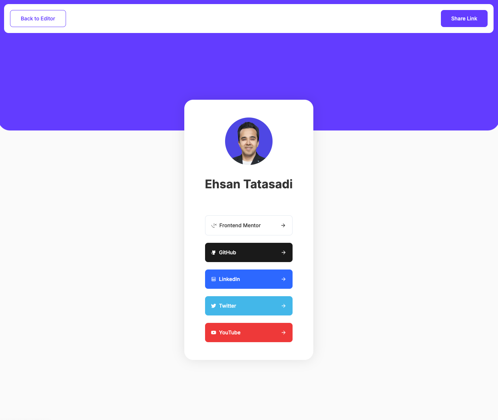

# Link-Sharing App

A full-stack web application built with Next.js, React, and TypeScript for managing and sharing
personalized profile links. Users can create, update, and delete links, customize their profiles,
and view real-time profile previews. It also supports reordering links through a drag-and-drop
interface, enabling full customization of how profiles are displayed.

## Table of Contents

- [Link-Sharing App](#link-sharing-app)
  - [Table of Contents](#table-of-contents)
  - [Features](#features)
  - [Tech Stack](#tech-stack)
  - [Installation](#installation)
  - [Deployment](#deployment)
  - [Screenshots](#screenshots)
  - [Links](#links)
  - [My Process](#my-process)
    - [Built with](#built-with)
    - [Code Quality with](#code-quality-with)
  - [Author](#author)

## Features

- **Link Management**: Add, edit, delete, and reorder links via drag-and-drop functionality.
- **Profile Customization**: Update profile details, including profile picture, first name, last
  name, and email.
- **Real-Time Preview**: See live changes to your profile before saving.
- **Form Handling & Validation**: Forms are powered by React Hook Form with schema validation using
  Zod.
- **State Management**: Application state is managed with Zustand for a clean, scalable
  architecture.
- **User Authentication**: Secure authentication system using NextAuth.
- **Image Upload**: Upload profile pictures securely to Amazon S3.
- **Clipboard Integration**: Easily copy your profile URL with one click.
- **Public Profile Sharing**: Share your profile link with others, allowing anyone to view your
  social links and profile information.
- **Responsive Design**: Optimized for all screen sizes with a clean mobile-first layout.

## Tech Stack

- **Frontend**: React, TypeScript, Next.js, Tailwind CSS, Shadcn
- **Forms**: React Hook Form, Zod (for validation)
- **State Management**: Zustand
- **Backend**: Prisma ORM, PostgreSQL
- **Authentication**: NextAuth
- **File Storage**: Amazon S3
- **Database**: PostgreSQL
- **Component Documentation**: Storybook

## Installation

1. Clone the repository:

```bash
git clone https://github.com/tatasadi/link-sharing-app.git
cd link-sharing-app
```

2. Install dependencies:

```bash
npm install
```

3. Set up environment variables:

Create a `.env` file in the root directory with the following keys:

```plaintext
DATABASE_URL=your_postgresql_database_url
AUTH_SECRET=your_auth_secret
AWS_ACCESS_KEY_ID=your_aws_access_key_id
AWS_SECRET_ACCESS_KEY=your_aws_secret_access_key
AWS_REGION=your_aws_region
AWS_BUCKET_NAME=your_s3_bucket_name
```

4. Run the Prisma migrations:

```bash
npx prisma migrate dev
```

5. Start the development server:

```bash
npm run dev
```

The app should now be running on `http://localhost:3000`.

## Deployment

This project can be deployed using [Vercel](https://vercel.com/) or any other hosting provider that
supports Next.js.

1. Push your project to a Git repository.
2. Link your repository to Vercel and set up the necessary environment variables.
3. Deploy the app using Vercel's deployment pipeline.

## Screenshots

  
  


## Links

- Solution URL:
  [https://github.com/tatasadi/link-sharing-app](https://github.com/tatasadi/link-sharing-app)
- Live Site URL: [https://link-sharing-app-ta.vercel.app](https://link-sharing-app-ta.vercel.app)

## My Process

### Built with


### Code Quality with


## Author

- Website - [Ehsan Tatasadi](https://ehsan.tatasadi.com)
- Frontend Mentor - [@tatasadi](https://www.frontendmentor.io/profile/tatasadi)
- GitHub - [@tatasadi](https://github.com/tatasadi)
- Linkedin - [Ehsan Tatasadi](https://www.linkedin.com/in/ehsan-tatasadi-2161a433)
- Twitter - [@etatasadi](https://twitter.com/etatasadi)
